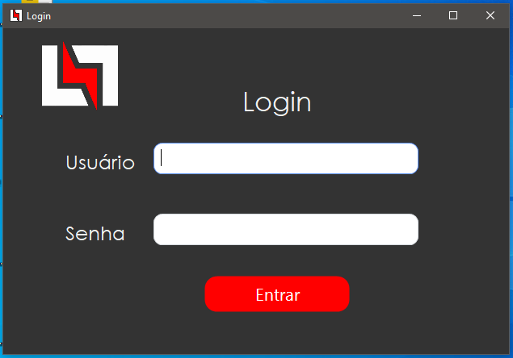
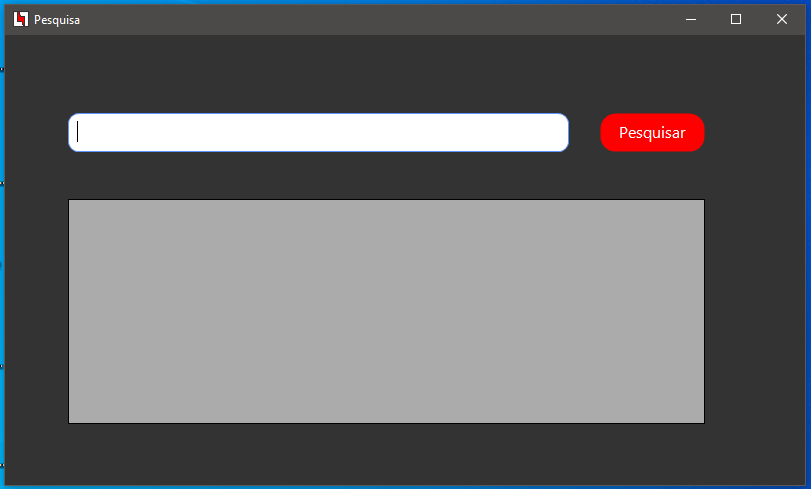
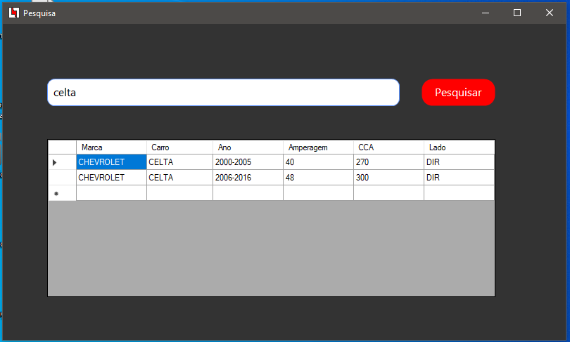
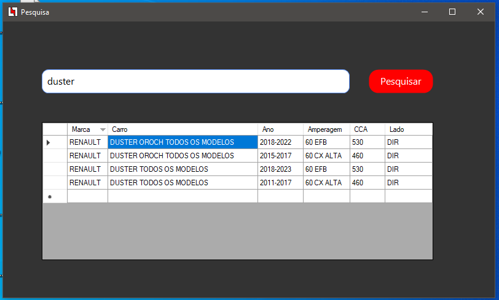

# 🔋 BateriaFacil

**BateriaFacil** é uma aplicação desktop desenvolvida em **C# (Windows Forms)** que ajuda a identificar rapidamente **qual bateria usar em determinado modelo de veículo**. Com um banco de dados local em **SQLite**, a ferramenta realiza consultas instantâneas a partir do nome do carro, exibindo informações como **marca, ano, amperagem, CCA** e o **lado da bateria**.

---

## ⚙️ Funcionalidades

- 🔐 Tela de login com autenticação local;
- 🚗 Consulta por nome do veículo;
- 📊 Resultados com marca, ano, amperagem, CCA e lado;
- 🗃️ Banco de dados local (`bateria2.db`);
- ✅ Interface simples, objetiva e ideal para uso em auto centers.

---

## 📸 Demonstração

### Tela de Login  

### Consulta de Bateria  

### Exemplo de pesquisa

### Segundo exemplo de pesquisa

---

## 📁 Estrutura do Projeto

- `Form1.cs`: Tela de login com verificação no banco;
- `princial.cs`: Tela principal para consultas;
- `bateria2.db`: Base de dados SQLite com veículos e especificações de bateria;

---

## ▶️ Como usar

1. Compile o projeto no **Visual Studio**;
2. Certifique-se de que o arquivo `bateria2.db` está na mesma pasta que o executável;
3. Use o login padrão (ex: `admin / admin`), conforme configurado no banco de dados;
4. Digite o nome do carro no campo de busca e pressione Enter.

---

## 🧠 Tecnologias utilizadas

- **C# / Windows Forms**
- **SQLite**
- **Visual Studio**
- **Inno Setup** (*para a criação do instalador*)
- **SQLiteStudio** (*para edição do banco de dados*)

---

## 🏪 Inspiração e contexto

Este sistema foi desenvolvido para uso prático na loja onde atuo, com o objetivo de agilizar o atendimento e facilitar a consulta de especificações de baterias automotivas para clientes e equipe técnica.

---

## 💡 Observações

- O banco de dados pode ser facilmente expandido com mais modelos e marcas. Recomendo o uso do SQLiteStudio, pela sua praticidade e facilidade;
- Toda a lógica de conexão, busca e exibição está centralizada no formulário principal.

---

> Projeto desenvolvido por Nathan Fernandes Alves para agilizar a rotina de atendimento em lojas de baterias e oficinas automotivas.
